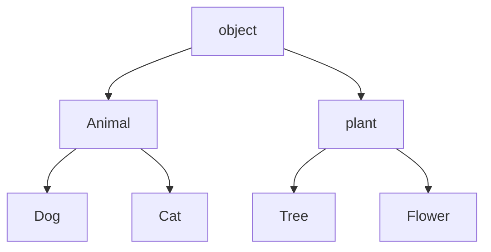

**继承**

~~~python
class Animal(object):
	def run(self):
		print('Animal is running……')

#Dog,Cat类继承Animal类
class Dog(Animal):
    pass

class Cat(Animal):
    pass

dog = Dog()
cat = Cat()
dog.run()
cat.run()
'''
Animal is running……
Animal is running……
'''
~~~

**增加子类方法**

~~~python
class Dog(Animal):
	def eat(self):
		print('Eating meat....')
dog = Dog()
dog.run()
dog.eat()
'''
Animal is running……
Eating meat....
'''
~~~

**改写父类方法,多态，子类的实例属于子类，也同时属于父类**

~~~python
class Dog(Animal):
	def run(self):
		print('Dog is running……')
class Cat(Animal):
	def run(self):
		print('Cat is running……')
dog = Dog()
cat = Cat()
dog.run()
cat.run()
'''
Dog is running……
Cat is running……
'''
~~~

**函数的多态**

~~~Python
def run_twice(animal):
    animal.run()
    animal.run()
~~~

~~~Python
run_twice(Animal())
run_twice(Dog())
run_twice(Cat())
~~~

结果：

>Animal is running……
>Animal is running……
>Dog is running……
>Dog is running……
>Cat is running……
>Cat is running……

